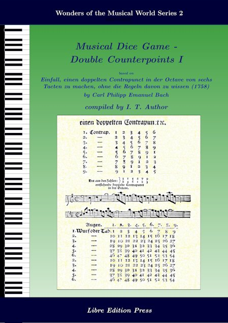

## mdgBookSVG2Kit

**Here's an opportunity for one to "compose" double counterpoints of six measures (DCSM) and to author a Collection Book!!!**  

<script src="https://moinejf.free.fr/js/abcweb-1.js"></script>
<script src="https://moinejf.free.fr/js/snd-1.js"></script>
<style type='text/css'>
    svg {display:block}
</style>

<p><center>
<script type="text/vnd.abc">
%abc-4.93
%<![CDATA[
%%scale 0.65
%%pagewidth 21.10cm
%%bgcolor white
%%topspace 0
%%composerspace 0
%%leftmargin 0.80cm
%%rightmargin 0.80cm
X:2044257688
T:1w4-3w5-4w3-2w6-7w1-6w1
%%setfont-1 Courier-Bold 14
T:$1cpeb::1w4-12w14-22w21-29w33-43w37-51w46-:$0
T:$1Perm. No.: 2044257688$0
M:2/2
L:1/4
Q:1/4=90
%%staves [1 2]
V:1 clef=treble
V:2 clef=bass
K:C
%1
[V:1]|: egec |\
[V:2]|: C,2C2 |\
%2
[V:1] e/G/ g/^f/ g2 |\
[V:2] CC2B, |\
%3
[V:1] g/c/ B/c/ f2 |\
[V:2] A,A, A,/C/ A,/F,/ |\
%4
[V:1] f e/d/ ec |\
[V:2] G,G,CC |\
%5
[V:1] dGgf |\
[V:2] C B,/A,/B,2 |\
%6
[V:1] e/g/ e/d/ c2 :|]
[V:2] C4 :|]
%]]>;
</script>
</center></p>
<p><br/></p>
(When online, left-clicking towards the left margin of the image above plays an audio of the sample DCSM shown. Thanks to `abc2svg` (see the [`abc2svg` Documentation](https://chiselapp.com/user/moinejf/repository/abc2svg/doc/trunk/README.md) for more info).

This folder contains materials that allow the user to author a book containing a collection of [Musical Dice Games (MDG)](https://en.wikipedia.org/wiki/Musikalisches_W%C3%BCrfelspiel) DCSM, generated based on the rules given in C.P.E. Bach's [*Einfall, einen doppelten Contrapunct in der Octave von sechs Tacten zu machen, ohne die Regeln davon zu wissen*](https://www.jstor.org/stable/843301).

To creat a book, simply [download](https://github.com/justineuro/mdgBookSVG2Kit/archive/main.zip) (or clone: `git clone https://github.com/justineuro/mdgBookSVG2Kit.git`) this project to one's computer, unzip the downloaded archive, and at the command line inside the main folder (`mdgBookSVG2Kit-main` directory) issue the following command (pre-requisites: `bash`, `abcmidi`, `abcm2ps`, `Ghostscript`, `Inkscape`, and `LaTeX`):

```shell
bash HOWTO
```

Wait for a **few** minutes, i.e., until one gets the bash prompt again.  The compiled book in PDF format (`mdgBookSVG2v1.pdf`), among other things, should be located in the `res` folder (subdirectory).  

## For the Impatient
To examine an example of a book (`mdgBookSVG2v1.pdf`) that was generated in a similar manner, simply left-click on the image below; to download a copy right-click (then "Save Link As ...") on the image:

[](https://raw.githubusercontent.com/justineuro/mdgBookSVG2Kit/main/mdgBookSVG2v1.pdf)

(**Note**: To enable the MIDI audio links in the book, one should download [mdgBookSVG2v1_1-midi.zip](https://github.com/justineuro/mdgBookSVG2Kit/raw/main/mdgBookSVG2v1_1-midi.zip) and unzip in the same directory in one's computer that contains the book, i.e., the book and midi files have to be in the same directory).

## Important Parameters
To personalize one's generated book (in addition to the randomly generated DCMS), one may want to change some of the default parameters/values in the following (all three files are initially found in the main directory but are eventually moved into the `res` folder): 

- `mdgBookSVG2v1.tex` - (main latex file) see lines 36-46; also, one may have to occassionally change the \\topmargin and \\textheight values on lines 298 and 299 of this file to ensure that each audio MIDI file will be on the same page as the corresponding musical score; these values affect the pages containing the 150 DCSMs and are different from the global values that appear on lines 30 and 31 near the top part of the file
- `mdgBookSVG2v1-cover.tex`- makes the cover of the book; see lines 36-46 of `mdgBookSVG2v1.tex` for default values
- `hyperref.cfg` - contains the `\hypersetup` keyvalues; one may wish to change the default value of `pdfauthor`, among other keyvalues; see the documentation for the TeX package `hyperref` for more information on these keyvalues

Once the desired changes have been made to the files above, one can then re-compile the book by issuing, in the `res` subdirectoy, the last set of commmands in the HOWTO file:
```shell
pdflatex -synctex=1 -interaction=nonstopmode -shell-escape mdgBookSVG2v1.tex
bibtex mdgBookSVG2v1.aux
pdflatex -synctex=1 -interaction=nonstopmode -shell-escape mdgBookSVG2v1.tex
pdflatex -synctex=1 -interaction=nonstopmode -shell-escape mdgBookSVG2v1.tex
```

Also, line 32 of the `HOWTO` is set by default so that each new book created contains 150 DCSMs.  One may wish to change this number, as desired, to some other counting number.  This has to be done **before** issuing the `bash HOWTO` command within the `mdgBookSVG2Kit-main` directory.

## Similar Kits on GitHub
MDG Book kits similar to this may be found on related GitHub sites such as:

- [mdgBookSVGKit](https://github.com/justineuro/mdgBookSVGKit) - MDG based on [*Musikalisches W&uuml;rferspiel, K. 516f*](http://imslp.org/wiki/Musikalisches_W%C3%BCrfelspiel,_K.516f_%28Mozart,_Wolfgang_Amadeus%29), attributed to Wolfgang Amadeus Mozart
- [mdgBookSVG3Kit](https://justineuro.github.io/mdgBookSVG3Kit) - One-Command Kit for Creating MDG (Kirnberger) Minuet-Trios Collection Book, the minuet-trios are generated based on the rules given in [*Der allezeit fertige Polonoisen- und Menuettencomponist* (*1757*)](https://imslp.org/wiki/Der_allezeit_fertige_Polonoisen-_und_Menuettencomponist_(Kirnberger%2C_Johann_Philipp)) 
- [mdgBookSVG4Kit](https://justineuro.github.io/mdgBookSVG4Kit) - One-Command Kit for Creating MDG Minuet-Trios Collection Book, the minuet-trios are generated based on the rules given in [*Table pour composer des Minuets et des Trios &agrave; la infinie*](http://imslp.org/wiki/Table_pour_composer_des_Minuets_et_des_Trios_%C3%A0_la_infinie_(Stadler,_Maximilian)) (also known as or *Tabelle welcher aus man unzählige Menuetten und Trio für das Klavier herauswürfeln kann* or *Gioco Filarmonico o sia maniera facile per comporre un infinito numero di menuetti e trio, anche senza sapere il contrapunto*) 
- [mdgBookSVG4itKit](https://github.com/justineuro/mdgBookSVG4itKit) - MDG based on [*Gioco Filarmonico o sia maniera facile per comporre un infinito numero di menuetti e trio, anche senza sapere il contrapunto*](http://imslp.org/wiki/Table_pour_composer_des_Minuets_et_des_Trios_%C3%A0_la_infinie_(Stadler,_Maximilian)); similar to  [mdgBookSVG4Kit](https://github.com/justineuro/mdgBookSVG4Kit) but arranged for three (3) instruments
- [mdgBookSVG6Kit](https://justineuro.github.io/mdgBookSVG4Kit) - One-Command Kit for Creating MDG Scottish Dances (Dance-Trios) Collection Book, each dance-trio is generated based on the rules given in [*Kunst, Schottische Taenze zu componiren, ohne musicalisch zu sein*](https://imslp.org/wiki/Kunst%2C_Schottische_Taenze_zu_componiren%2C_ohne_musicalisch_zu_sein_(Gerlach%2C_Gustav))


## Related Sites
- [Opus Infinity](https://opus-infinity.org/) - Collaborative work of Robbert Harms, Hein Moors, and Suus van Petegem whose goal is to unravel the mystery behind the tables used for generating MDGs.  Site visitors can generate MDGs based on works of Kirnberger, Mozart, Stadler/Haydn, Bach, and Gerlach.  Corresponding audio files (<tt>mid</tt>, <tt>ogg</tt>, and/or <tt>mp3</tt>) and image files (<tt>pdf</tt> or <tt>png</tt>) are also made available for listening, viewing, or downloading.
- [Mozart](https://marian-aldenhoevel.de/mozart/) - A site maintained by Marian Aldenh&ouml;vel allows the visitor to generate a MDG (user-specified or randomly-generated) and the corresponding audio (<tt> midi</tt>, <tt>wav</tt>) and image files (<tt>pdf</tt>, <tt>png</tt>) based on *Musikalisches W&uuml;rferspiel, K. 516f*.
- [Mozart](http://sunsite.univie.ac.at/Mozart/dice/) - A site maintained by John Chuang that allows the site visitor to generate MDGs based on the work of Stadler/Haydn.
- [`mozart.zip`](https://www.amaranthpublishing.com/mozart.zip) -  This is a Windows software (&copy; 1995 VisionSoft) by John Chuang and Stephen Goodwin that generates MDG based on input from user and is available for <em> free</em> from  [Amaranth Publishing](http://www.amaranthpublishing.com/MozartDiceGame.htm). 
-  [Mozart - Musical Game in C K. 516f*](http://www.asahi-net.or.jp/~rb5h-ngc/e/k516f.htm), Mozart Studies Online - The site of Hideo Noguchi that offers an explanation linking <tt> Musikalisches W&uuml;rferspiel, K. 516f</tt> and <tt>K. 294d (K. Anh. C 30.01)</tt>.

## Acknowledgements
My sincerest gratitude to E. Eugene Helm for the translation of [*Einfall*](https://www.jstor.org/stable/843301); Chris Walshaw et al. for the [ABC music notation](http://www.abcnotation.com);  Jean-Francois Moine for [abcm2ps](http://moinejf.free.fr/) and the accompanying examples, templates, and pointers for the appropriate use of these resources;  Guido Gonzato for the [ABC Plus Project](http://abcplus.sourceforge.net/) and the [abcmidi resources](http://abcplus.sourceforge.net/#abcMIDI) available there, more especially for the ABC resource book *Making Music with ABC 2*; James R. Allwright and Seymour Shlien for [abcmidi](http://abc.sourceforge.net/abcMIDI) source and binaries; Nils Liberg, Jan Wybren de Jong, Seymour Shlien et al. for [EasyABC](https://easyabc.sourceforge.net); [Artifex, Inc.](https://artifex.com) for `Ghostscript v.10.00.0` (includes the `ps2pdf` converter); [`Inkscape v.1.2.2`](https://www.inkscape.org) for the tool for converting SVGs to PDFs for inclusion into LaTeX documents; Colomban Wendling et. al for [Geany 2.0 IDE](https://www.geany.org); and [<tt>User:Martin H</tt>](https://tex.stackexchange.com/users/632/martin-h) for his [reply](https://tex.stackexchange.com/questions/2099/how-to-include-svg-diagrams-in-latex) to a TeX/LaTeX Stack Exchange question on including SVGs into LaTeX documents.  Special thanks also to [JSTOR](https://www.jstor.org/stable/843301) (in collaboration with Duke University Press and Yale University) and [Opus Infinity](https://opus-infinity.org) and  for making available the score for [*Einfall*](https://opus-infinity.org/dice_games/cpebach_counterpoint/measures/),  [International Music Score Library Project (IMSLP)](http://imslp.org/) for making available [*Historisch-Kritische Beyträge zur Aufnahme der Musik Bd.3*](https://imslp.org/wiki/Historisch-Kritische_Beytr%C3%A4ge_zur_Aufnahme_der_Musik_(Marpurg,_Friedrich_Wilhelm)),  and [Amaranth Publishing](http://www.amaranthpublishing.com/MozartDiceGame.htm) for a copy of <tt>mozart.zip</tt>.  Ditto to Machtelt Garrels for the book [Bash Guide for Beginners](http://tldp.org/LDP/Bash-Beginners-Guide/html/Bash-Beginners-Guide.html), Vivek Gite for the book [Linux Script Shell Tutorial](http://www.freeos.com/guides/lsst/), Steve Parker for the [Unix/Linux Shell Cheatsheet](http://steve-parker.org/sh/cheatsheet.pdf).  John Fogarty's GitHub Site: [Latex CreateSpace BookCover](https://github.com/jfogarty/latex-createspace-bookcover) and Peter Wilson's reply in TeX/LaTeX Stack Exchange on [designing a book cover](https://tex.stackexchange.com/questions/17579/how-can-i-design-a-book-cover) were sources of ideas, information, and materials for creating the book cover and title page, thanks to both of them. Many thanks to the [Debian Project](https://www.debian.org) for the Debian 12 (Bookworm) GNU/Linux OS, [TeXLive 2024](http://www.tug.org/texlive/) for the TeX distribution, to Brian Fox for [Bash](https://www.gnu.org/software/bash/), and [GitHub](https://github.com) for its generosity in providing space for [this project](https://github.com/justineuro/mdgBookSVG2Kit).

## License
<p xmlns:dct="http://purl.org/dc/terms/" xmlns:vcard="http://www.w3.org/2001/vcard-rdf/3.0#">
  <a rel="license"
     href="http://creativecommons.org/publicdomain/zero/1.0/">
    
  </a>
  <br />
  To the extent possible under law,
  <a rel="dct:publisher"
     href="https://github.com/justineuro">
    <span property="dct:title">Justine Leon A. Uro</span></a>
  has waived all copyright and related or neighboring rights to
  <span property="dct:title"><a href="https://github.com/justineuro/mdgBookSVG2Kit">mdgBookSVG2Kit</a></span>.
This work is published from:
<span property="vcard:Country" datatype="dct:ISO3166"
      content="PH" about="https://github.com/justineuro/mdgBookSVG2Kit">
  Philippines</span>.
</p>